[](https://opensource.org/licenses/MIT)
[](https://github.com/your-repo/your-project)

## 1. Project Overview

This repository contains the implementation of a **Big Data**-focused **Modern Hybrid Data Platform**, developed as the **Graduation Project** for the **ITI Data Engineering Track**. The architecture is designed to handle both **large-scale batch ETL** and **high-velocity real-time streaming** data workloads. The platform leverages a robust, cloud-native, and open-source technology stack to ensure **scalability**, **reliability**, and **high data quality**—key requirements for any Big Data solution.

The architecture is divided into two primary flows:
1.  **Batch Data Pipeline:** For historical and transactional data, processed through a structured data lake and prepared for Business Intelligence (BI) reporting.
2.  **Real-time Streaming Pipeline:** For high-velocity event data, processed and stored for low-latency operational monitoring and analytics.

## 2. System Architecture

The following diagram illustrates the end-to-end data flow and the components of the platform, showcasing both the batch ETL pipeline and the real-time streaming pipeline.

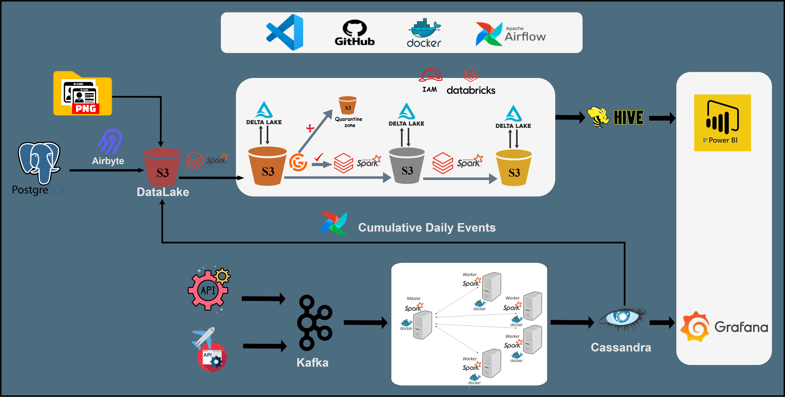

The architecture is divided into two primary flows:
- **Upper Flow (Batch Pipeline):** PostgreSQL → Airbyte → DataLake (S3/Delta Lake) → Spark transformations with Great Expectations → Hive → Power BI
- **Lower Flow (Real-time Streaming):** External APIs → Kafka → Spark Cluster (Docker) → Cassandra → Grafana
- **Cross-Pipeline Integration:** Daily consolidated events from Cassandra are fed back into the DataLake for historical analysis

## 3. Key Technologies

The platform is built using a comprehensive set of **Big Data** tools, managed and deployed via **Docker** and orchestrated by **Apache Airflow**. The selection of technologies like **Apache Spark**, **Delta Lake**, **Apache Hive**, and **Apache Cassandra** is specifically chosen to address the challenges of processing and storing data at scale.

| Category | Technology | Role in the Platform |
| :--- | :--- | :--- |
| **Data Sources** | PostgreSQL, External APIs | Primary sources for transactional and event data. |
| **Data Ingestion** | Airbyte | ELT tool for moving data from PostgreSQL to the Datalake. |
| **Data Storage** | AWS S3, Delta Lake | Scalable, cloud-native object storage with ACID properties for the Datalake. |
| **Data Processing** | Apache Spark (Cluster) | High-performance engine for batch transformations and real-time stream processing. |
| **Data Quality** | Great Expectations | Automated validation and profiling of data quality throughout the pipeline. |
| **Data Warehouse** | Apache Hive | Traditional data warehousing layer for structured BI consumption. |
| **NoSQL Store** | Apache Cassandra | Distributed NoSQL database for low-latency, high-availability storage of streaming data. |
| **Orchestration** | Apache Airflow | Scheduling and monitoring of complex batch ETL workflows (DAGs). |
| **Visualization** | Power BI, Grafana | Tools for business reporting (BI) and operational monitoring (Real-time). |
| **Development** | VS Code, GitHub, Docker | Standardized tools for development, version control, and containerization. |

## 4. Data Flow Details

### 4.1. Batch ETL Pipeline (BI Reporting)

This pipeline focuses on transforming raw data into clean, aggregated, and business-ready datasets, following a Medallion Architecture pattern (Bronze, Silver, Gold layers in S3/Delta Lake).

1.  **Ingestion:** Data from **PostgreSQL** and user credentials are ingested into the Datalake (S3/Delta Lake) using **Airbyte**.
2.  **Transformation:** **Apache Spark** processes the raw data, applying transformations and cleansing rules. **Great Expectations** is integrated at key stages to validate data quality and integrity.
3.  **Data Warehouse:** The final, curated data is loaded into **Apache Hive** for structured querying.
4.  **Consumption:** **Power BI** connects to Hive to generate comprehensive business reports and dashboards.

### 4.2. Real-time Streaming Pipeline (Operational Monitoring)

This pipeline is designed for low-latency processing of high-volume event streams.

1.  **Ingestion & Processing:** Data from external **APIs** is fed directly into a dedicated **Apache Spark Cluster** (running on Docker) for real-time stream processing.
2.  **Storage:** The processed, enriched event data is stored in **Apache Cassandra**, optimized for fast reads and writes.
3.  **Monitoring:** **Grafana** connects to Cassandra to provide real-time operational dashboards, alerting, and performance monitoring.

### 4.3. Dimensional Data Model

The data warehouse follows a **galaxy schema** design optimized for analytical queries and business intelligence reporting. The model includes fact tables for flight bookings and hotel bookings, connected to multiple dimension tables.

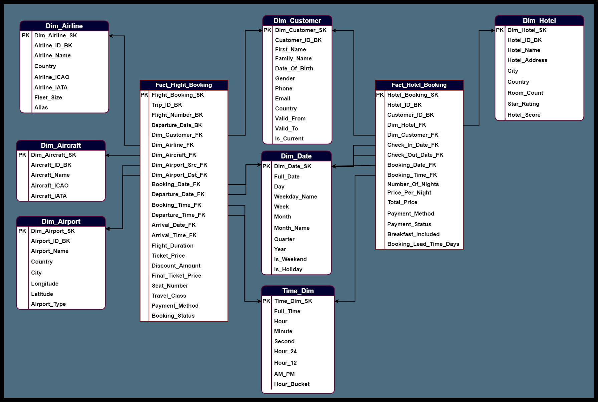

**Key Components:**

**Fact Tables:**
- `Fact_Flight_Booking` - Central fact table for flight transactions with measures like ticket price, discount amount, and flight duration
- `Fact_Hotel_Booking` - Central fact table for hotel reservations with measures like price per night, total price, and booking lead time

**Dimension Tables:**
- `Dim_Customer` - Customer demographics and profile information with SCD Type 2 (Valid_From, Valid_To, Is_Current)
- `Dim_Date` - Comprehensive date dimension with day, week, month, quarter, year attributes and flags for weekends/holidays
- `Time_Dim` - Time-of-day dimension for temporal analysis
- `Dim_Airline` - Airline information including ICAO/IATA codes and fleet details
- `Dim_Aircraft` - Aircraft specifications and identifiers
- `Dim_Airport` - Airport details including location coordinates and airport type
- `Dim_Hotel` - Hotel properties with ratings, location, and amenities

This dimensional model enables efficient analytical queries for business intelligence, supporting complex aggregations and slice-and-dice operations across multiple business dimensions.

## 5. Orchestration and Monitoring

### 5.1. Workflow Orchestration with Apache Airflow

All batch data workflows are managed as Directed Acyclic Graphs (DAGs) within **Apache Airflow**. This ensures reliable scheduling, dependency management, and monitoring of the ETL processes.

To view the status of all scheduled jobs, you can access the Airflow Web UI:

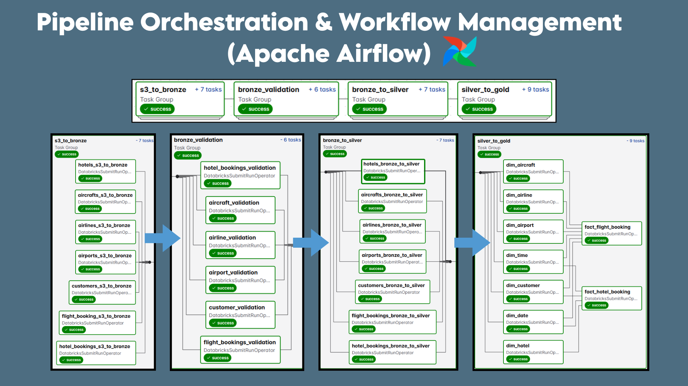

### 5.2. Data Visualization and Dashboards

The platform provides two distinct visualization layers:

#### Business Intelligence (Power BI)
Used for strategic reporting, historical analysis, and key performance indicator (KPI) tracking from the curated data in Hive.

**Dashboard 1: Executive Overview**
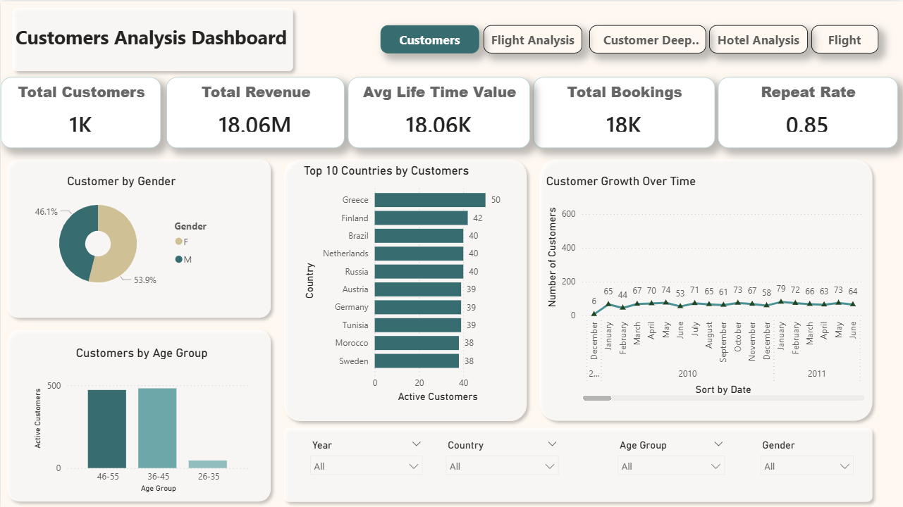

**Dashboard 2: Operational Metrics**
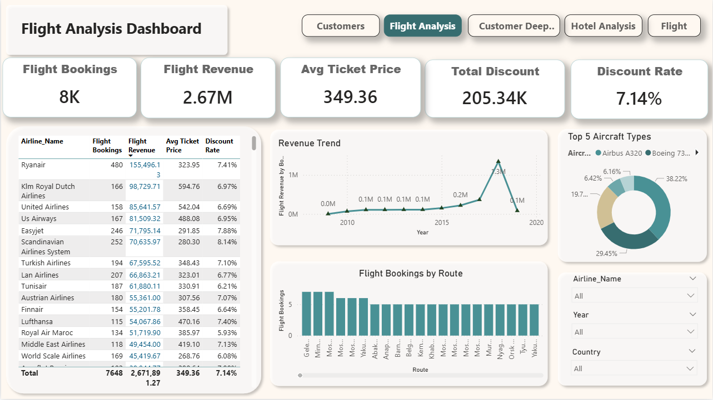

**Dashboard 3: Performance Analysis**
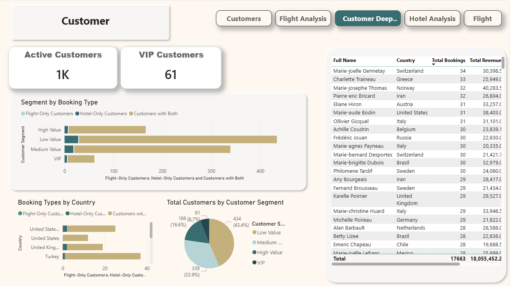

**Dashboard 4: Revenue Analytics**
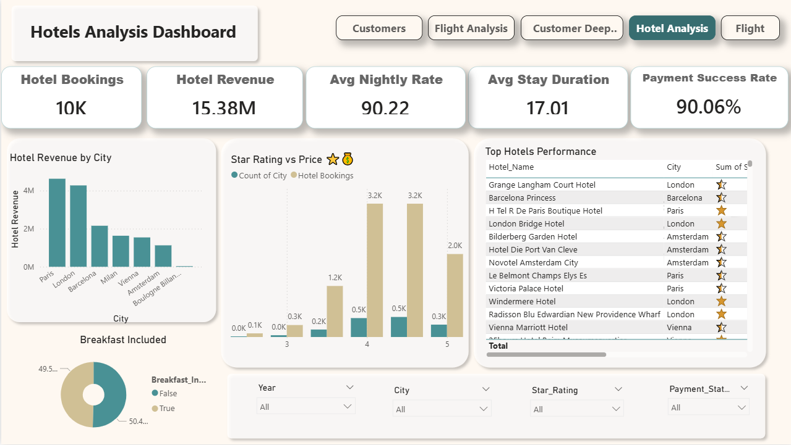

**Dashboard 5: Customer Insights**
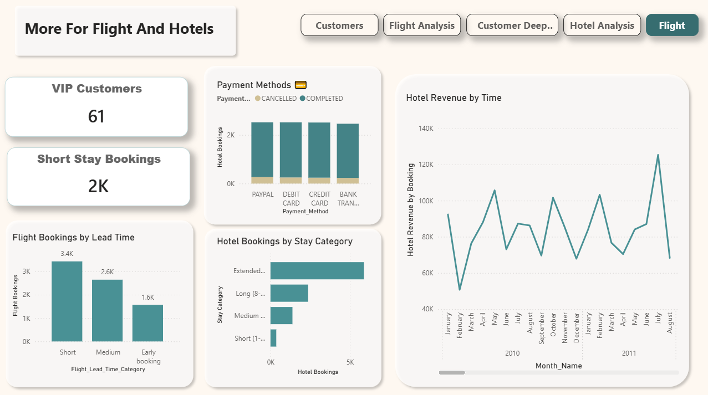

#### Operational Monitoring (Grafana)
Used for real-time visibility into the health and performance of the streaming pipeline and the underlying infrastructure.

**Dashboard 1: System Overview**
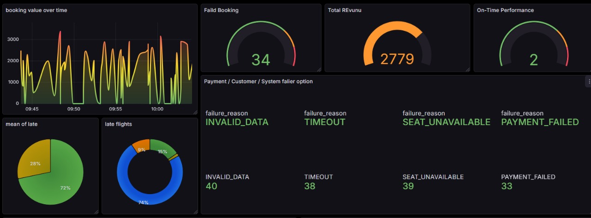

**Dashboard 2: Real-time Booking Analytics**
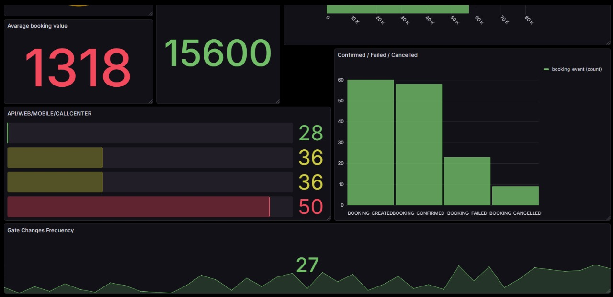

This dashboard provides live visibility into booking performance metrics including average booking value, booking status distribution (confirmed/failed/cancelled), channel-specific performance, and gate change frequency tracking.

**Dashboard 3: Infrastructure Monitoring**
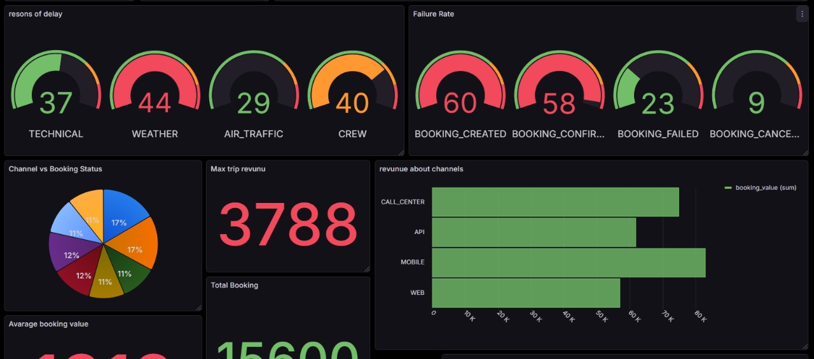

### 5.3. Proactive Alerting System

The platform implements automated monitoring and alerting through **Grafana**, integrated with **Telegram** for instant notifications. Critical metrics such as booking failure rates are continuously tracked, with alerts configured to trigger when thresholds (e.g., 15% failure rate) are exceeded. This proactive approach ensures rapid incident response and maintains high system availability.

**Alert Example 1: High Booking Failure Rate**
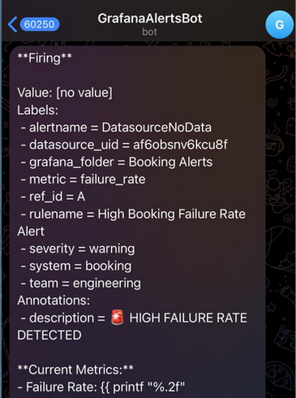

**Alert Example 2: System Anomaly Detection**
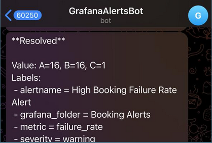

The alert system provides detailed context including metric values, severity levels, and affected components, enabling the engineering team to quickly diagnose and resolve issues before they impact business operations.

## 6. Setup and Deployment

The entire environment is containerized using **Docker** for consistent and reproducible deployment across development, staging, and production environments.

1.  **Prerequisites:** Docker, Docker Compose, and a running Spark Cluster environment.
2.  **Deployment:**
    ```bash
# Clone the repository
git clone https://github.com/ahmed-hassouna/Travel-Agency-Lakehouse-Platform.git
cd Travel-Agency-Lakehouse-Platform

# Start all services (Airflow, PostgreSQL, Cassandra, etc.)
docker-compose up -d

# Airflow DAGs are located in the dags/ directory
# The Airflow container will automatically detect and load them

    ```
3.  **Configuration:** Update connection details for Airbyte, Spark, and the BI tools in the respective configuration files.

## 7. Contributing

We welcome contributions! Please see the `CONTRIBUTING.md` for details on our code of conduct, and the process for submitting pull requests.

## 8. License

This project is licensed under the MIT License - see the [LICENSE.md](LICENSE.md) file for details.


