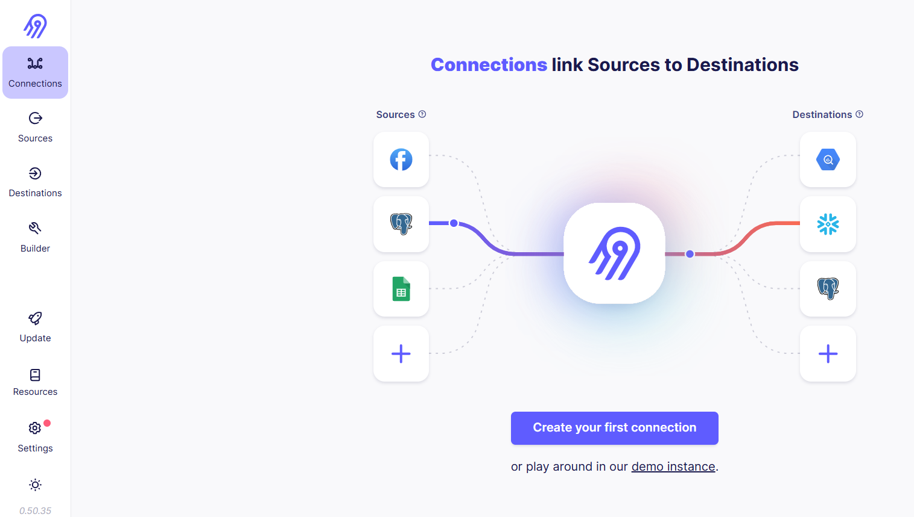
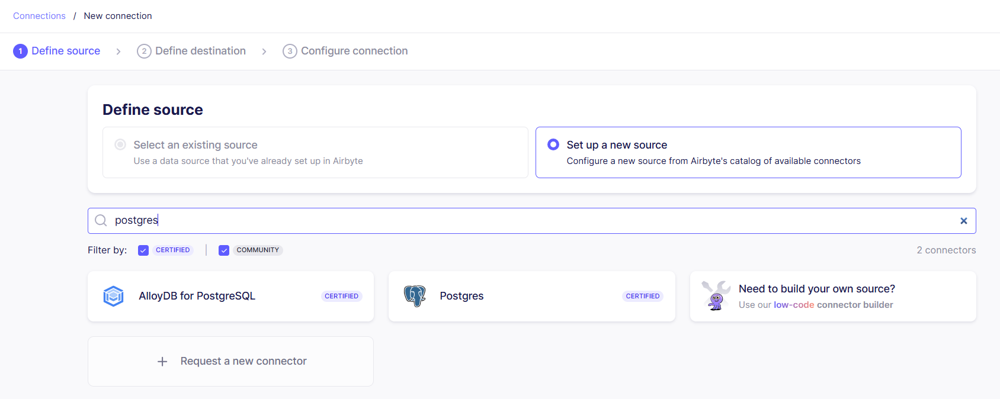
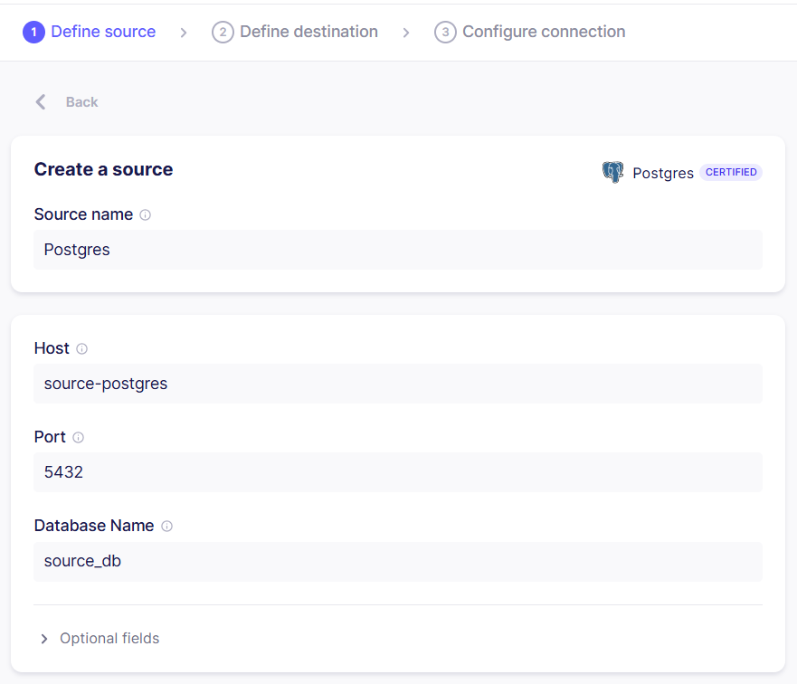
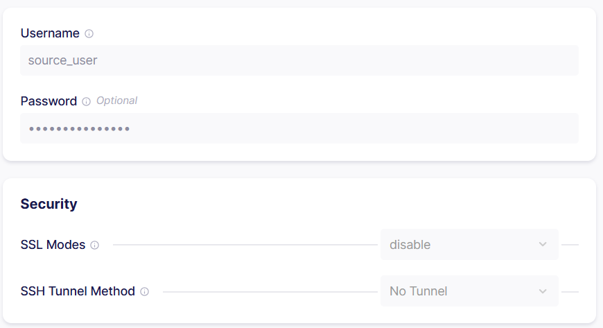
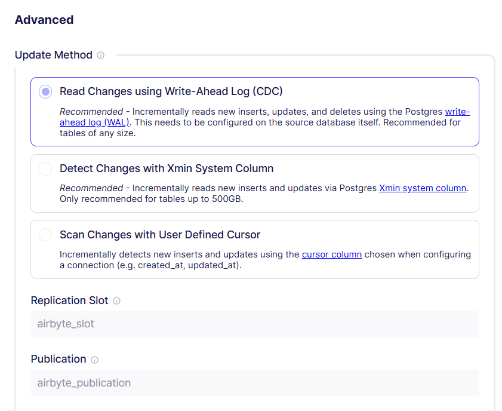

# Airbyte CDC Configuration Guide

## Document Overview

**Purpose:** This document provides a comprehensive guide for configuring Change Data Capture (CDC) using PostgreSQL logical replication with Airbyte for the Travel Agency Lakehouse Platform.

---

## 1. Introduction to CDC

### 1.1 What is Change Data Capture?

Change Data Capture (CDC) is a design pattern that tracks and captures changes made to a database in near real-time. Instead of performing full table scans on every sync, CDC enables incremental replication by reading only the changes (inserts, updates, deletes) from the database transaction log.

### 1.2 Why CDC for This Project?

**Business Requirements:**
- **Near Real-Time Data:** Travel bookings require timely data propagation to the analytics layer
- **Reduced Database Load:** Incremental updates minimize impact on production PostgreSQL
- **Complete Change History:** Capture all data modifications including deletes
- **Efficiency:** Reduce network bandwidth and storage costs

**Technical Benefits:**
- **Low Latency:** Changes replicated within seconds to minutes
- **Scalability:** Handles high-volume transactional databases efficiently
- **Data Consistency:** ACID-compliant change capture
- **No Application Changes:** Operates at database level without code modifications

---

## 2. Airbyte Source Configuration (PostgreSQL)

### 2.1 Create New PostgreSQL Source

**Navigate to:** Airbyte UI → Sources → Add New Source → PostgreSQL



---

### 2.2 Connection Details



**Define Source:**  
Complete the following values from the Docker Compose configuration:

| Field | Value | Description |
|------|------|-------------|
| **Source Name** | `postgres` | Descriptive name |
| **Host** | `source-postgres` | Docker service name or IP |
| **Port** | `5432` | Default PostgreSQL port |
| **Database Name** | `source_db` | Source database |
| **Username** | `source_user` | Database user |
| **Password** | `airbyte` | User password |

  


---

### 2.3 Advanced Configuration – Change Data Capture (CDC)

Airbyte provides multiple methods to detect changes in PostgreSQL source tables. Choosing the correct method is critical for performance, scalability, and data accuracy.



---

#### 2.3.1 Read Changes Using Write-Ahead Log (CDC) — **Recommended**

This method uses PostgreSQL’s **Write-Ahead Log (WAL)** to capture:

- INSERT
- UPDATE
- DELETE

##### PostgreSQL CDC Script

To enable **Change Data Capture (CDC)** using PostgreSQL logical replication, you **must execute the following SQL script on the PostgreSQL source database** before configuring Airbyte in CDC mode:

📄 **PostgreSQL CDC Configuration Script**  
[`postgres_cdc_configuration_for_airbyte.sql`](./postgres_cdc_configuration_for_airbyte.sql)

This script prepares the source database by:
- Enabling logical replication prerequisites
- Creating the required publication
- Granting necessary permissions for Airbyte

**How it works:**
- PostgreSQL writes changes to the WAL
- Airbyte reads changes using a logical replication slot
- Data is streamed incrementally without table scans

**Advantages:**
- Supports very large tables
- Captures deletes
- Minimal impact on the source database
- Near real-time replication

**Requirements:**
- Logical replication enabled
- Publication and replication slot configured

**Recommended for:**
- Production systems
- High-volume transactional databases
- Enterprise-grade pipelines

---

#### 2.3.2 Detect Changes Using `xmin` System Column

This method uses PostgreSQL’s internal `xmin` system column.

**How it works:**
- Airbyte compares `xmin` values to detect new or updated rows

**Limitations:**
- Does not capture deletes
- Recommended only for tables up to 500 GB
- Transaction ID wraparound risk

**Recommended for:**
- Medium-sized tables
- Systems where deletes are not critical

---

#### 2.3.3 Scan Changes Using User-Defined Cursor

This method relies on user-managed columns such as:
- `created_at`
- `updated_at`

**How it works:**
- Rows are selected where the cursor value is greater than the last synced value

**Limitations:**
- Deletes are not detected
- Requires reliable cursor column
- Poor indexing may cause full table scans

**Recommended for:**
- Simple schemas
- Append-only or update-light workloads

---

## 3. S3 Destination Configuration

### 3.1 Overview

After configuring the PostgreSQL source with CDC, data is written to Amazon S3 as the Bronze layer of the Data Lakehouse.

---

### 3.2 AWS IAM Configuration

**Best Practice:**  
Create a dedicated IAM user with least-privilege access for Airbyte operations.

---

#### 3.2.1 Create IAM Policy

**Policy Name:** `Airbyte_S3_Policy`

**Policy JSON:**
```json
{
  "Version": "2012-10-17",
  "Statement": [
    {
      "Effect": "Allow",
      "Action": [
        "s3:PutObject",
        "s3:GetObject",
        "s3:DeleteObject",
        "s3:PutObjectAcl",
        "s3:ListBucket",
        "s3:ListBucketMultipartUploads",
        "s3:AbortMultipartUpload",
        "s3:GetBucketLocation"
      ],
      "Resource": [
        "arn:aws:s3:::travel-analytics-bronze",
        "arn:aws:s3:::travel-analytics-bronze/*"
      ]
    }
  ]
}
